<div align="center">

<!-- ANIMATED HEADER -->


<!-- TYPING ANIMATION -->
<a href="https://git.io/typing-svg">
  
</a>
<br/>

<!-- PROFILE VIEWS + BADGES -->
<a href="https://github.com/saugatedith"></a>
&nbsp;
<a href="https://saikripa.com.np/"></a>
&nbsp;
<a href="mailto:github@saikripa.com.np"></a>

</div>

---

## 🧬 Who Am I?

```python
class SaugatPokharel:
    name        = "Saugat Pokharel"
    location    = "Hetauda, Nepal 🇳🇵"
    stack       = ["React", "JavaScript", "Django REST", "Python", "PostgreSQL", "Docker"]
    interests   = ["Full-Stack Architecture", "Cybersecurity", "AI/ML Systems"]
    currently   = "Forging React + Django REST + AI-powered systems"
    philosophy  = "One man's backdoor is another man's undocumented feature."
    open_to     = ["Collaboration", "Freelance", "Open Source"]
    portfolio   = "https://saikripa.com.np/"

    def current_focus(self):
        return ["Building secure full-stack apps",
                "Ethical hacking & pentesting",
                "Integrating AI into real products"]
```

---

## ⚔️ Core Arsenal

<div align="center">

### 🖥️ Frontend


### ⚙️ Backend


### 🤖 AI / ML


### 🔐 Security & DevOps


</div>

---

## 📊 GitHub Stats

<div align="center">

<!-- Stats cards generated dynamically -->


<br/><br/>

<!-- STREAK STATS -->


</div>

---

## 🏆 GitHub Trophies

<div align="center">
  
</div>

---

## 🐍 Contribution Snake

<div align="center">

<!-- Auto-generated via GitHub Actions every 12 hours -->


</div>

---

<div align="center">
<table border="0" cellpadding="0" cellspacing="0">
  <tr>
    <td valign="middle" align="center">
      
    </td>
    <td width="40"></td>
    <td valign="middle" align="left">
      <br/>
      <pre><code><b>root@saugat:~$</b> whoami
ethical_hacker | ai_builder | architect

<b>root@saugat:~$</b> cat core_directives.txt
> Forge unbreakable digital fortresses
> Turn caffeine into exploits & code
> Automate the boring stuff with AI

<b>root@saugat:~$</b> ./run_ai_tetris.sh
[+] CSS Animation Engine... [OK]
[+] Calculating perfect drops... [OK]
[+] Executing payload on the left...
</code></pre>
    </td>
  </tr>
</table>
</div>

---

## 🌐 Connect With Me

<div align="center">

<a href="https://twitter.com/saugat1111" target="_blank">
  
</a>
&nbsp;
<a href="https://linkedin.com/in/saugat-pokharel-63390323a" target="_blank">
  
</a>
&nbsp;
<a href="https://fb.com/saugat1111" target="_blank">
  
</a>
&nbsp;
<a href="https://instagram.com/saugatedith" target="_blank">
  
</a>
&nbsp;
<a href="https://saikripa.com.np/" target="_blank">
  
</a>

</div>

---

## 💡 Fun Fact

> *"One man's backdoor is another man's undocumented feature."*
>
> — Saugat Pokharel, Ethical Hacker & Full Stack Architect

---

<div align="center">

<!-- FOOTER WAVE -->


**⭐ If you found my work useful, please consider starring my repos!**

</div>